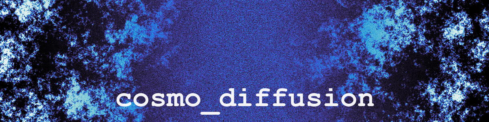

Train 2D/3D diffusion (and flow-matching) models — UNet, UNet-Conditional, DiT,
and PixArt — for cosmological applications.

## Install

```bash
git clone https://github.com/nkern/cosmo_diffusion
cd cosmo_diffusion
pip install -e .
```

## Dependencies

- `numpy`
- `torch`
- `diffusers`
- `accelerate`
- `tqdm`
- `pyyaml`
- `scipy`
- `h5py`
- `matplotlib`
- `ema-pytorch`

## Quick demo

Configure a training run in `cosmodiff/data/config.yaml` (paths, model,
scheduler, training kwargs), then launch:

```bash
cosmodiff_train.py --config path/to/config.yaml
```

Checkpoints and metrics are written automatically to the `output_dir` set in
the config.  To sample from a trained checkpoint:

```bash
cosmodiff_sample.py --output_dir path/to/run \
    --n_samples 64 --output samples.npy
```

For fast inference, swap in a higher-order solver:

```bash
cosmodiff_sample.py --output_dir path/to/run \
    --scheduler DPMSolverMultistepScheduler --num_steps 25 \
    --n_samples 64 --output samples.npy
```

## Authors

- Nicholas Kern
- Jiaming Pan
